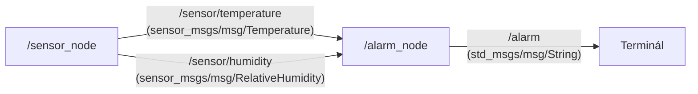

# kin_zy2_teperaturalarm


ROS 2 Humble alapú környezeti állapotfigyelő rendszer, amely hőmérséklet- és relatív páratartalom-értékeket szimulál, és határérték-átlépés esetén riasztásokat generál.

---

## Rendszerarchitektúra



---

## Küszöbértékek és működés

| Paraméter | Normál tartomány | Riasztási küszöb | Üzenet / Értékelés |
| :--- | :--- | :--- | :--- |
| **Hőmérséklet** | 15.0 °C – 30.0 °C | > 30.0 °C | `[RIASZTAS: TUL MELEG]` |
| **Hőmérséklet** | 15.0 °C – 30.0 °C | < 15.0 °C | `[RIASZTAS: TUL HIDEG]` |
| **Relatív pára** | ≤ 75.0 % | > 75.0 % | `[RIASZTAS: MAGAS PARATARTALOM]` |

- **/sensor_node**: 1 Hz frekvenciával oszcilláló (szinuszos) tesztértékeket publikál a szenzortémákra.
- **/alarm_node**: Figyeli a bejövő telemetriát, határérték-átlépésnél összeállítja a riasztást, és kiküldi az `/alarm` topicra.

---

## Build és Futtatás

```bash
# Fordítás a workspace gyökeréből
cd ~/ros2_ws
colcon build --packages-select kin_zy2_teperaturalarm --symlink-install

# Környezet betöltése és indítás
source ~/ros2_ws/install/setup.bash
ros2 launch kin_zy2_teperaturalarm teperaturalarm.launch.py
```
