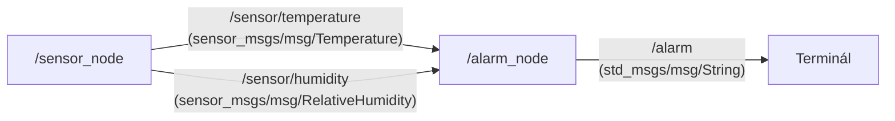

# kin_zy2_teperaturalarm package

Egyszerű ROS 2 C++ csomag környezeti adatok (hőmérséklet, relatív páratartalom) szimulálására és küszöbérték-alapú riasztásra ROS 2 Humble alatt.

## Node-topic architektúra



## Működés leírása

- **/sensor_node**: 1 Hz frekvenciával oszcilláló szimulált adatokat publikál a `/sensor/temperature` és `/sensor/humidity` topicokra.
- **/alarm_node**: Feliratkozik a szenzor topicokra. Ha a hőmérséklet 30 °C fölé nő vagy 15 °C alá esik, illetve ha a páratartalom 75% feletti, figyelmeztető üzenetet publikál az `/alarm` topicra.

---

## Build és Futtatás

Feltételezzük, hogy a munkaterület: `~/ros2_ws/`.

```bash
# Csomagok klónozása:
cd ~/ros2_ws/src
git clone https://github.com/kiad018/kin_zy2_teperaturalarm.git

# Fordítás a workspace gyökeréből:
cd ~/ros2_ws
colcon build --packages-select kin_zy2_teperaturalarm --symlink-install

# Környezet betöltése és központi indítás:
source ~/ros2_ws/install/setup.bash
ros2 launch kin_zy2_teperaturalarm teperaturalarm.launch.py
```

---

## Diagnosztika és tesztelés

A futó rendszer állapota külön terminálablakból ellenőrizhető a ROS 2 beépített eszközeivel:

```bash
# Elérhető topicok listázása
ros2 topic list

# Folyamatos hőmérséklet-telemetria kiolvasása
ros2 topic echo /sensor/temperature

# Folyamatos páratartalom-telemetria kiolvasása
ros2 topic echo /sensor/humidity

# Riasztási állapot figyelése
ros2 topic echo /alarm
```
